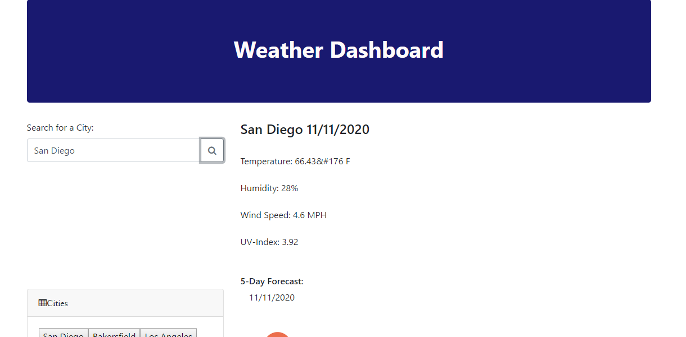
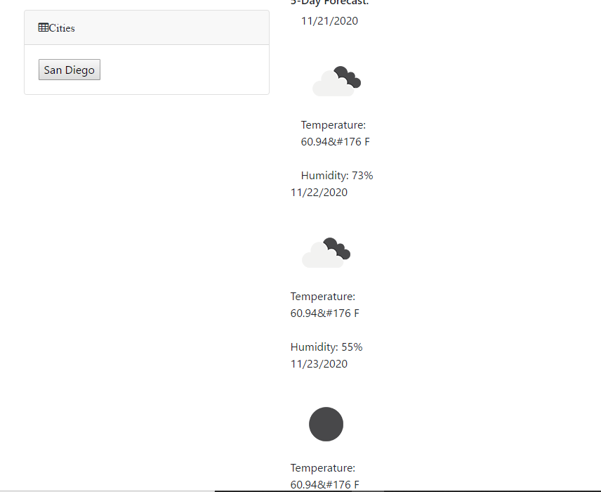

# Weather-Dashboard-
Creating a simple weather and forecast application that allows users to track current weather and see a 5 day forecast. 
## Overview
This project is designated of traveling users that are concerned with the weather and forecasts of cities they will be visiting. 
When the user inputs the city in which they will be traveling to they will receive information of that city that includes:

City name, current date (MM/DD/YYYY),
Temperature (F),
Humidity,
Wind Speed,
UV Index

In addition, a 5 day forecast that show the following:

Day 1 (MM/DD/YYYY),
Day 1 Temperature,
Day 1 Humidity

Day 2 (MM/DD/YYYY),
Day 2 Temperature,
Day 2 Humidity

Day 3 (MM/DD/YYYY),
Day 3 Temperature,
Day 3 Humidity

Day 4 (MM/DD/YYYY),
Day 4 Temperature,
Day 4 Humidity

Day 5 (MM/DD/YYYY),
Day 5 Temperature,
Day 5 Humidity

### Application Preview

 

### Application Link
https://xicano619.github.io/Weather-Dashboard-/

